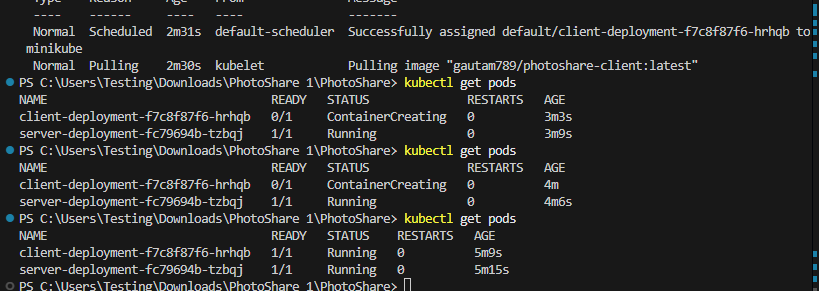

# PhotoShare

PhotoShare is a full-stack photo sharing application built with Next.js (frontend) and Node.js/Express (backend), using MongoDB Atlas for cloud storage.

## Features
- Upload and view photos
- Modern UI with Next.js and Tailwind CSS
- Image storage using MongoDB GridFS
- Dockerized for easy deployment
- Kubernetes-ready manifests for cloud-native deployment

## Getting Started

### Local Development
1. Clone the repository
2. Build and run with Docker Compose:
   ```bash
   docker compose up --build
   ```
3. Open [http://localhost:3000](http://localhost:3000) in your browser

### Kubernetes Deployment
1. Build and push Docker images to Docker Hub
2. Apply Kubernetes manifests in the `k8s/` directory:
   ```bash
   kubectl apply -f k8s/mongo-secret.yml
   kubectl apply -f k8s/server-deployment.yml
   kubectl apply -f k8s/client-deployment.yml
   ```

## Project Structure
- `client/` - Next.js frontend
  
  
  
- `server/` - Node.js/Express backend

 
  
- `k8s/` - Kubernetes manifests

   
---

For more details, see the `client/README.md` and `server/README.md` files.
# PhotoShare
